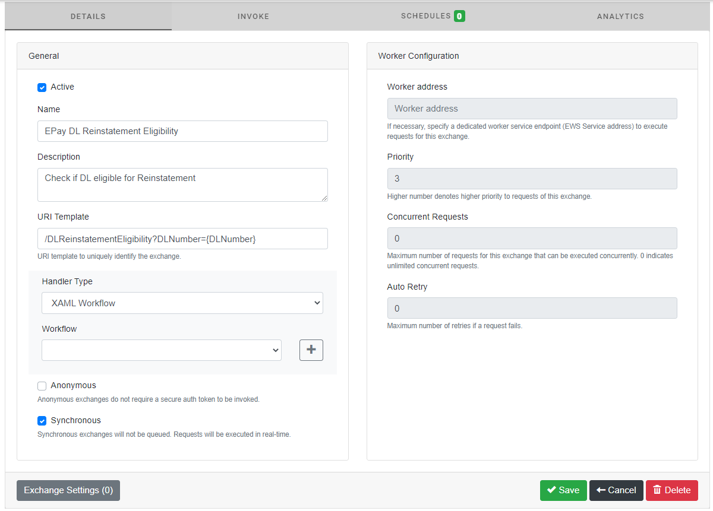

## QB

### Authentication

A valid ShowCase user account is required to login to the application. This version does not require any special permissions to be assiged to the user in the ShowCase system.

| Property | Description |
| --- | --- |
| Active | Denotes if the exchange is active. DES will not accept incoming requests for inactive exchanges. |
| Name | Name given to the data exchange. |
| Description | Description and details of the data exchange. |
| Uri Template | A template for the url that uniquely identifies this exchange. |
| Handler Type | A handler that contains the execution logic of this data exchange. Possible options are a XAML workflow, or a .NET class. |
| Anonymous | Denotes if the data exchange can be invoked anonymously. |
| Synchronous | Denotes if the handler for this data exchange is invoked in synchronous or asynchronous fashion. |
| Workder Address | (*Async exchanges only*) Specifies the worker service that executes the handler. |
| Prioirty | (*Async exchanges only*) The priority assigned to the requests of this data exchange. |
| Concurrent Requests | (*Async exchanges only*) Total number of requests of this data exchange that can run concurrently. |
| Auto Retry | (*Async exchanges only*) Indicates the number of times failed requests of this data exchange can be re-tried. |